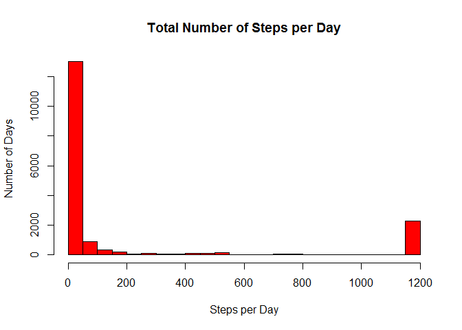

# Reproducible Research
Josep Aguilera  
Saturday, April 11, 2015  


# Peer Assessment 1

## Loading and preprocessing the data

1. Load the data
2. Process/transform the data (if necessary) into a format suitable for your analysis


```r
activityFile<-read.csv("activity.csv",header=T,sep=',',
          check.names=F,stringsAsFactors=F,comment.char="",quote='\"',na.strings="NA")
```

## What is mean total number of steps taken per day?

For this part of the assignment, you can ignore the missing values in the dataset.

1. Calculate the total number of steps taken per day
2. If you do not understand the difference between a histogram and a barplot, research the difference between them. Make a histogram of the total number of steps taken each day
3. Calculate and report the mean and median of the total number of steps taken per day


```r
stepsDay <- tapply(activityFile$steps, activityFile$date, FUN=sum, na.rm=TRUE)

stepsDay<-subset(stepsDay,subset=(stepsDay>0))

hist(stepsDay,col="red",breaks=20,main="Total Number of Steps per Day",xlab="Steps per Day",ylab="Number of Days")
```

 

```r
head(stepsDay)
```

```
## 2012-10-02 2012-10-03 2012-10-04 2012-10-05 2012-10-06 2012-10-07 
##        126      11352      12116      13294      15420      11015
```

```r
summary(stepsDay)
```

```
##    Min. 1st Qu.  Median    Mean 3rd Qu.    Max. 
##      41    8841   10760   10770   13290   21190
```

All days with number of steps equal to 0 has been remove due to them correspond to
days with NA missing values, and them are not desired when calculating histogram.

The total number of steps per day is can be seen in variable "stepsDay". First values are shown.

The mean of total number of steps taken per day is 10770 and the median is 10760.

## What is the average daily activity pattern?

1. Make a time series plot (i.e. type = "l") of the 5-minute interval (x-axis) and the average number of steps taken, averaged across all days (y-axis)


```r
library(ggplot2)

meanDaily <- aggregate(steps ~ interval,data=activityFile,FUN="mean",na.rm=TRUE)

ggplot(meanDaily, aes(interval,steps)) + geom_line(color = "red",lwd = 1) + xlab("5-minute Interval") + ylab("Average Steps per Day") + ggtitle("Average Daily Activity Pattern")
```

 

2. Question: Which 5-minute interval, on average across all the days in the dataset, contains the maximum number of steps?


```r
maxInterval <- meanDaily$interval[which.max(meanDaily$steps)]
maxInterval
```

```
## [1] 835
```
The 835 5-minute interval contains the maximum number of steps.


## Imputing missing values

Note that there are a number of days/intervals where there are missing values (coded as NA). The presence of missing days may introduce bias into some calculations or summaries of the data.

1. Calculate and report the total number of missing values in the dataset (i.e. the total number of rows with NAs)

```r
sum(is.na(activityFile$steps))
```

```
## [1] 2304
```
The total number of missing values is 2304

2. Devise a strategy for filling in all of the missing values in the dataset. The strategy does not need to be sophisticated. For example, you could use the mean/median for that day, or the mean for that 5-minute interval, etc.

I choose the mean for that 5-minute interval.
 
3. Create a new dataset that is equal to the original dataset but with the missing data filled in


```r
activityFileBackup <- activityFile
activityFileBackup$date<-as.Date(activityFileBackup$date,format="%Y-%m-%d")
subSet <- activityFileBackup[is.na(activityFileBackup)==TRUE,]

activityFileBackup$steps[is.na(activityFileBackup$steps)==TRUE] <- tapply(subSet$interval, subSet$date, FUN=mean)

sum(is.na(activityFileBackup$steps))
```

```
## [1] 0
```

4. Make a histogram of the total number of steps taken each day and Calculate and report the mean and median total number of steps taken per day. Do these values differ from the estimates from the first part of the assignment? What is the impact of imputing missing data on the estimates of the total daily number of steps?


```r
hist(activityFileBackup$steps,col="red",breaks=20,main="Total Number of Steps per Day",xlab="Steps per Day",ylab="Number of Days")
```

 

```r
summary(activityFileBackup$steps)
```

```
##    Min. 1st Qu.  Median    Mean 3rd Qu.    Max. 
##     0.0     0.0     0.0   186.9    57.0  1178.0
```

 The mean and median total number of steps taken per day now are 186,9 and 0 respectively. Yes that these values differ from the previous calculated. The impact is high due to the mean strategy choosed together with the high number of missing values impact highly in results.

## Are there differences in activity patterns between weekdays and weekends?

For this part the weekdays() function may be of some help here. Use the dataset with the filled-in missing values for this part.

1. Create a new factor variable in the dataset with two levels - "weekday" and "weekend" indicating whether a given date is a weekday or weekend day.


```r
activityFileWeekEnd <- activityFile
activityFileWeekEnd$dayofweek <- c("weekend", "weekday", "weekday", "weekday", "weekday", "weekday", "weekend")[as.POSIXlt(activityFileWeekEnd$date)$wday + 1]
```

2. Make a panel plot containing a time series plot (i.e. type = "l") of the 5-minute interval (x-axis) and the average number of steps taken, averaged across all weekday days or weekend days (y-axis). 


```r
require(gridExtra) 
```

```
## Loading required package: gridExtra
## Loading required package: grid
```

```r
library(lattice)

meanDaysWeek <- aggregate(activityFileWeekEnd$steps,list(activityFileWeekEnd$interval,activityFileWeekEnd$dayofweek),FUN=mean,na.rm=TRUE)

names(meanDaysWeek)[1] <- "interval"
names(meanDaysWeek)[2] <- "dayofweek"
names(meanDaysWeek)[3] <- "steps"

weekDays <- subset(meanDaysWeek,subset=(dayofweek =="weekday"))
weekEnd <- subset(meanDaysWeek,subset=(dayofweek =="weekend"))

plot1 <- xyplot(steps ~ interval, data=weekEnd, type='l', xlab="5-minute Interval",ylab="Average Steps per Day",main="WeekEnd")

plot2 <- xyplot(steps ~ interval, data=weekDays, type='l', xlab="5-minute Interval",ylab="Average Steps per Day",main="WeekDays")

grid.arrange(plot1,plot2, nrow=2,heights=c(1,1), widths=c(1,1))
```

 
